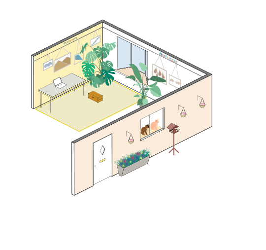
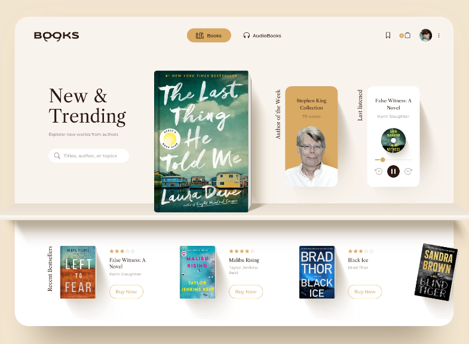
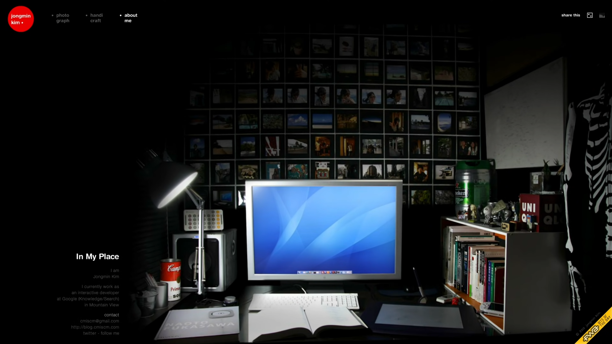
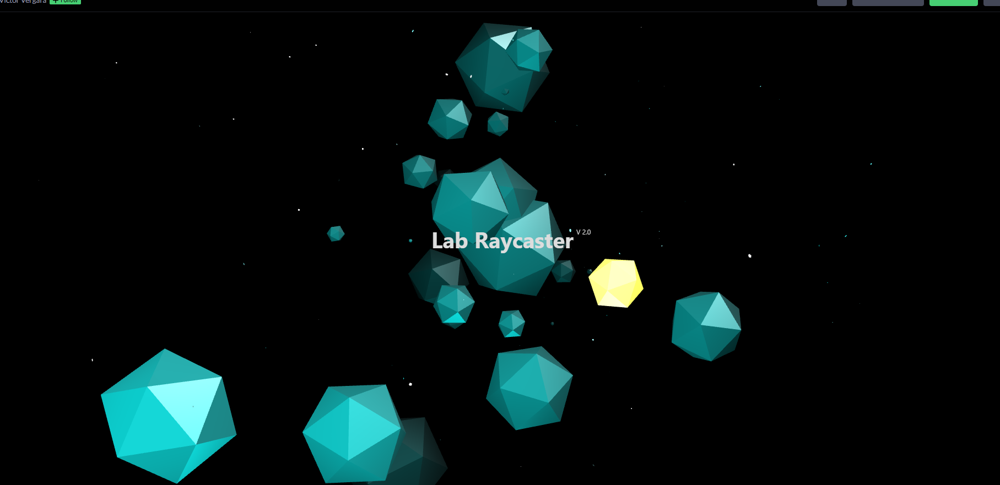
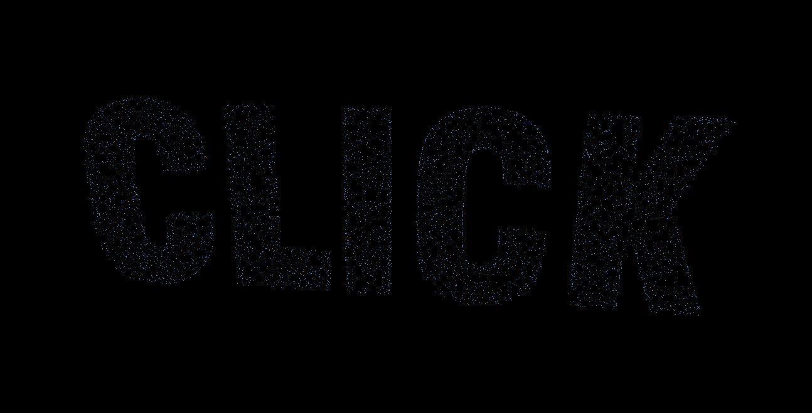

# CONTENTS

> 단순 포트폴리오보다는 재미 요소 & 실험실 기능이 같이 있는 홈페이지를 만들어 보면 어떨까?
>
> 레퍼런스가 많이 필요하겠다.

## 1. 프로필

## 2. 프로젝트들

## 3. 블로그 글

## 4. 방문자와 상호 작용하는 일러스트 or three.js

https://hanseul.com/

화분에 hover하면 화분이 닫혀있다 열리면서 그 상태에서 클릭하면 특정 링크로 연결된다.

https://oxeni.dev/

three.js로 구현한 배경

three.js가 메인인 프로젝트를 했는데 three.js를 못하는 나 이대로 괜찮은가

-> 다른 건 몰라도 three.js or webGL은 꼭 적용해보자

-> 내가 원하는 개체 만드려면 blender도 추가적으로 배워야 할듯

https://uicookies.com/threejs-examples/

three.js examples

## 5. SNS 링크들

## 6. 방명록

## 7. RSS

## 8. BGM

## 9. Wiki

## 10.  독후감 쓰는 곳

https://dribbble.com/shots/16279204-Book-Web-Store-Concept?utm_source=Clipboard_Shot&utm_campaign=nikitin&utm_content=Book%20Web%20Store%20Concept&utm_medium=Social_Share&utm_source=Clipboard_Shot&utm_campaign=nikitin&utm_content=Book%20Web%20Store%20Concept&utm_medium=Social_Share

----------------------------------

# References

interactive developer 김종민님의 포트폴리오 페이지(유튜브 채널에 공유되어 있다.)

기존 포트폴리오 웹사이트 레퍼런스들을 보다 보니 너무 모던하고, 템플릿을 쓴 것 같은 느낌이 나고, 흑/백, 네온, 파스텔 등의 색감이 뻔하게 느껴져 고민이었다.

그 너머에 있는 사람이 더 느껴지면 좋지 않을까 하는, 따뜻한 감성을 좋아하는 전적으로 내 의견...

내 집의 개발 공간(책상)을 멋있게 찍어서 배경으로 활용하거나 hover했을 때 이벤트가 발생하게 하면 좋겠다.

----------

# Prototype

## 메인 페이지

- 우주 컨셉
- 일반 React 페이지

## 메뉴들

- 별마다 메뉴가 있음(메뉴 안 내용은 일반 React 페이지로 할 것이므로 메인 페이지와 동시에 개발하기)

- 위키 or 블로그란에 가면 마인드 맵처럼 소행성? 작은 별들이 연결되어 나만의 마인드맵도 볼 수 있음(내 생각을 구조화 & 시각화 해서 축적해 나가고 싶다)

  - 이 부분을 three.js로 구현하는 것이 목표
  - 

  - 

------

# Questions

- 서버비???
  - AWS lambda, S3, 프리티어
  - GitHub 학생 계정 제휴한 곳들 살펴보기